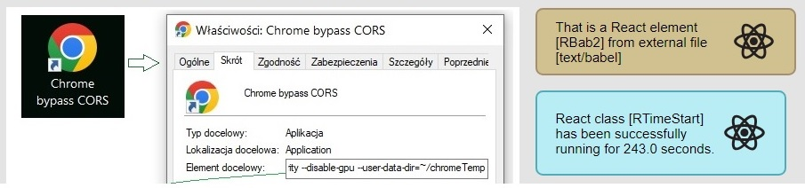

# Fixed the issue of including js files containing JSX syntax

This application shows how to solve the problem of including js files containing JSX syntax (script type="text/babel") without NPM tools, as an error occurs when including such a .js file.

The application from an html file index.html includes a React element jsx_def_elements.js with JSX (Babel) syntax.  

# How to disable the issue with include .js files?

Normally, a regular html file will not attach an external file 
      (internal in one html file it will allow) because the CORS security option of 
      the Chrome browser will not allow it and will generate an error.

However, to enable the developer to test, you can temporarily disable CORS in Chrome as follows:

Launch Chrome with CORS security disabled, from the prepared icon as: 
["C:\Program Files\Google\Chrome\Application\chrome.exe" --disable-web-security --disable-gpu --user-data-dir=~/chromeTemp] 

.

However, it is better to run a local web server or install the environment via Node npm.

## Details

- React ver.18 sources are linked online from the internet;
- The Babel ver.5.8 compiler for JSX syntax is linked online from the Internet;
- Project written in Visual Studio Code;
